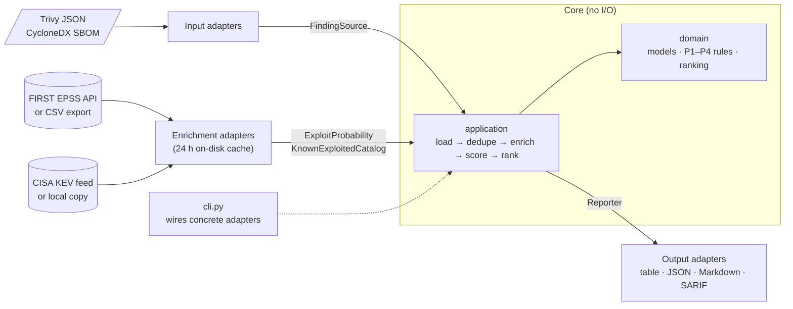

# vulnrank

[](https://github.com/Theodhor21/vulnrank/actions/workflows/ci.yml)


[](LICENSE)

**Turn a raw vulnerability scan into a short, prioritised list, with a reason for every decision.**

A container scan of `python:3.8` reports **11,652** vulnerabilities. Nobody can fix all of
them, and sorting by CVSS severity puts thousands of "critical" findings at the top that
are never attacked in practice. `vulnrank` answers the question a security team actually
has: *which 20 should we fix first, and why?*

It combines three signals:

- **Is it being exploited?** The [CISA Known Exploited Vulnerabilities](https://www.cisa.gov/known-exploited-vulnerabilities-catalog) catalog (KEV).
- **How likely is exploitation?** [EPSS](https://www.first.org/epss/), a daily probability of exploitation in the next 30 days.
- **Does it matter here?** Your own context: how critical the system is and whether it is exposed to the internet.

## Example

Real output for the public `nginx:1.19` image (Trivy scan in [`examples/`](examples/), EPSS
and KEV data as of 2026-09-27):

```sh
uv run vulnrank examples/nginx-1.19.trivy.json --format markdown --top 6
```

> P1: 2 · P2: 48 · P3: 154 · P4: 211 (415 unique findings from 415 scanned)
>
> | # | Tier | CVE | Component | EPSS | CVSS | KEV | Fix | Why |
> | ---: | --- | --- | --- | --- | --- | --- | --- | --- |
> | 1 | **P1** | [CVE-2023-44487](https://nvd.nist.gov/vuln/detail/CVE-2023-44487) | libnghttp2-14 1.36.0-2+deb10u1 | 100.0% | 7.5 | **yes** | 1.36.0-2+deb10u2 | in CISA KEV (added 2023-10-10) |
> | 2 | **P1** | [CVE-2023-4863](https://nvd.nist.gov/vuln/detail/CVE-2023-4863) | libwebp6 0.6.1-2 | 100.0% | 8.8 | **yes** | 0.6.1-2+deb10u3 | in CISA KEV (added 2023-09-13) |
> | 3 | **P2** | [CVE-2023-50387](https://nvd.nist.gov/vuln/detail/CVE-2023-50387) | libsystemd0 241-7~deb10u7 | 100.0% | 7.5 | no | no fix | EPSS 100.0% ≥ 10.0% |
> | 4 | **P2** | [CVE-2023-50387](https://nvd.nist.gov/vuln/detail/CVE-2023-50387) | libudev1 241-7~deb10u7 | 100.0% | 7.5 | no | no fix | EPSS 100.0% ≥ 10.0% |
> | 5 | **P2** | [CVE-2022-2068](https://nvd.nist.gov/vuln/detail/CVE-2022-2068) | libssl1.1 1.1.1d-0+deb10u6 | 95.4% | 7.3 | no | 1.1.1n-0+deb10u3 | EPSS 95.4% ≥ 10.0% |
> | 6 | **P2** | [CVE-2022-2068](https://nvd.nist.gov/vuln/detail/CVE-2022-2068) | openssl 1.1.1d-0+deb10u6 | 95.4% | 7.3 | no | 1.1.1n-0+deb10u3 | EPSS 95.4% ≥ 10.0% |

Of 415 findings, two are confirmed to be exploited in the wild (HTTP/2 "Rapid Reset" and
the libwebp heap overflow). Both have a fix available. That is where to start.

## Quick start

Requires [uv](https://docs.astral.sh/uv/getting-started/installation/). Clone and run it
on a real scan in one command:

```sh
git clone https://github.com/Theodhor21/vulnrank && cd vulnrank
uv run vulnrank examples/nginx-1.19.trivy.json
```

On your own image, with [Trivy](https://trivy.dev/):

```sh
trivy image --format json --output scan.json your-image:tag
uv run vulnrank scan.json --assets assets.toml --top 20
```

| Option | Purpose |
| --- | --- |
| `--format table\|json\|markdown\|sarif` | Terminal table (default), JSON for tools, Markdown for PRs, SARIF for GitHub code scanning |
| `--assets FILE` | Asset context and scoring thresholds ([example](examples/assets.toml)) |
| `--top N` | List the top N findings (default 20, `0` = all) |
| `--fail-on P1` | Exit with code 1 if any finding is at this tier or above: a CI gate |
| `--strict` | Exit with code 2 if EPSS or KEV data could not be loaded, so a gate never passes blind |
| `--target NAME` | Report findings under this name and match assets against it |
| `--offline` | No network: use cached EPSS/KEV data, or local files via `--epss-file` / `--kev-file` |

Input can be a Trivy JSON report or a CycloneDX JSON SBOM with vulnerabilities (UTF-8 or
UTF-16); the format is detected automatically. Exit codes: `0` ok, `1` findings at or above
`--fail-on`, `2` input, usage or internal error (a crash never exits with `1`).

Asset entries in `assets.toml` match a scan target by exact name, then by name without tag or
digest (`my-app` matches `my-app:abc123`), then by glob pattern (`ghcr.io/acme/*`). Targets that
match no entry get `[default_asset]`, with a warning.

## How the ranking works

No black-box score. Each finding goes into the **first** tier whose rule matches, and every
matching rule is shown as a reason.

| Tier | Rule (any one is enough) |
| --- | --- |
| **P1** | In CISA KEV · or EPSS ≥ 50% on a high/critical asset · or EPSS ≥ 10% on an internet-exposed critical asset |
| **P2** | EPSS ≥ 10% · or CVSS ≥ 9.0 on a high/critical asset |
| **P3** | CVSS ≥ 7.0 |
| **P4** | Everything else |

Without a CVSS score, the scanner's severity stands in for it at the bottom of its CVSS band
(critical 9.0, high 7.0), and the reason says so.

Within a tier, findings in KEV come first, then higher EPSS, then higher CVSS (unknown last),
then **fixable first**, because a patch that exists is the quickest win. A fix never changes
the tier: having a patch does not make a vulnerability more dangerous. When there is no fix,
the vendor's status is shown ("will not fix", "deferred", "end-of-life").

The ordering of signals is deliberate: **evidence of exploitation (KEV) beats probability of
exploitation (EPSS), which beats theoretical severity (CVSS)**. CVSS alone can only reach P3,
or P2 on an important asset.

Context changes the answer. Marking `nginx:1.19` as a critical, internet-exposed asset in
[`examples/assets.toml`](examples/assets.toml) moves it from 2 to 50 P1 findings, because on
such a system anything with a 10% chance of exploitation is urgent. Every threshold can be
tuned in the `[scoring]` section.

## Use it in CI

Fail the build on P1 findings and publish every finding to GitHub code scanning:

```yaml
permissions:
  contents: read
  security-events: write # to upload SARIF

steps:
  - uses: aquasecurity/setup-trivy@v0.3.1
  - uses: astral-sh/setup-uv@v10.2.0
  - run: trivy image --format json --output scan.json my-app:${{ github.sha }}
  - run: >
      uvx --from git+https://github.com/Theodhor21/vulnrank vulnrank scan.json
      --assets assets.toml --format sarif --top 0 --output vulnrank.sarif --fail-on P1
  - uses: github/codeql-action/upload-sarif@v4
    if: always() # upload results even when the gate fails
    with:
      sarif_file: vulnrank.sarif
```

In the SARIF output, tiers map onto GitHub's severity labels (P1 critical, P2 high, P3
medium, P4 low), so the Security tab sorts by vulnrank's priority, not raw CVSS.

## Architecture

Ports and adapters: the scoring core is pure Python with no I/O, and every external format
or service sits behind an interface.



| Layer | Knows about | Location |
| --- | --- | --- |
| `domain` | Nothing: models and scoring rules only | [`src/vulnrank/domain/`](src/vulnrank/domain/) |
| `ports` | `domain`: the `Protocol` interfaces | [`src/vulnrank/ports/`](src/vulnrank/ports/) |
| `application` | `domain` + `ports`: the use case | [`src/vulnrank/application/`](src/vulnrank/application/) |
| `adapters` | Their third-party format or API | [`src/vulnrank/adapters/`](src/vulnrank/adapters/) |
| `cli.py` | Everything: the only place concrete adapters are wired together | [`src/vulnrank/cli.py`](src/vulnrank/cli.py) |

The dependency rule is not just a convention: [a test](tests/test_architecture.py) parses
every module in the core and fails if it imports an adapter or an I/O library.

## Engineering notes

- **Tested without the network.** 367 tests at 100% line and branch coverage, enforced in
  CI. Every test runs inside an HTTP mock, so a test that forgets to mock a request fails
  instead of reaching the internet.
- **Test-first.** Later features were written test-first; the history shows each
  `test: … (red)` commit before its implementation.
- **Contract tests.** The same scan written in both input formats must produce identical
  findings. Comparing real Juice Shop scans this way caught a bug the hand-written fixtures
  had missed (scoped npm packages were named differently in CycloneDX).
- **Strict typing.** pyright in strict mode and Pydantic validation at every boundary.
- **Resilient by design.** A malformed record is logged and skipped, never fatal. If EPSS
  or KEV is unreachable, vulnrank falls back to stale cached data; without a cache the
  finding is ranked without that signal, and a warning on stderr says so.
- **Checked against the source.** The EPSS and KEV API details were verified against the
  official documentation and live responses, and generated SARIF is validated against
  the SARIF 2.1.0 schema.

Design decisions are recorded as short ADRs:

1. [Ports and adapters](docs/decisions/0001-ports-and-adapters.md)
2. [Rule-based scoring instead of an ML score](docs/decisions/0002-rule-based-scoring.md)
3. [Drop-and-log error handling](docs/decisions/0003-drop-and-log.md)

## Known limitations

- **EPSS and KEV cover CVEs only.** Advisories with only a GitHub (GHSA) or other ID are kept
  and ranked on CVSS or severity, but get no EPSS or KEV signal. In CycloneDX input, a CVE
  alias listed in `references` is used when present.
- **KEV outages.** If the KEV feed cannot be downloaded and nothing is cached, CVEs are
  treated as not in KEV. The report warns about it, and `--strict` turns it into exit code 2.
- **Severity labels can differ between formats.** CycloneDX does not record which vendor
  rating Trivy chose, so the display-only severity field may differ from the Trivy JSON
  report. Tiers and ordering are unaffected.
- **No reachability analysis.** A vulnerable package is ranked whether or not the code path
  is used in the container (e.g. kernel headers in `linux-libc-dev`).

## Development

```sh
uv sync      # create .venv and install dependencies
make check   # lint (ruff) + type check (pyright strict) + tests with coverage
```

Individual targets: `make lint`, `make format`, `make typecheck`, `make test`.

## License

[MIT](LICENSE) © 2026 Theodhor Zhobro
